<p align="center">
  
</p>

## 广东第二师范学院校园助手系统

### 应用介绍

**广东第二师范学院校园助手系统**是为广东第二师范学院专属打造的校园服务应用。它不仅提供了课表查询、成绩查询、四六级考试成绩查询、空课室查询、图书借阅查询、馆藏图书查询、教学质量评价、电费查询、黄页信息查询、校园卡充值、校园卡挂失、消费查询等综合性的教务功能，还提供了二手交易、失物招领、校园树洞、恋爱交友、表白墙、全民快递、话题、匿名评教等社区交流平台。广东二师助手旨在为广东第二师范学院的在校师生们提供最优质的教育教学、校园生活、社团活动、文化娱乐和教务服务等信息。四年时光，广东二师助手陪你一起走过。

### 技术说明

广东第二师范学院校园助手系统是基于网络爬虫模拟登录技术和Spring、SpringMVC、Mybatis框架开发的校园应用，已正式投入广东第二师范学院生产环境供在校师生使用。应用采用前后端分离的架构设计，前端界面使用第三方WeUI样式库，后端利用JSON和Restful API为前端和移动端提供数据接口。目前应用支持Android、UWP、微信小程序等多个客户端，并利用OAuth2.0技术，接入微信公众号、易班网等多个平台。

### 安全规格

为保障用户的信息和资金安全，应用从多个层面添加了安全保护措施。

#### 网络通信

应用使用了请求防重放攻击校验、对称加密算法、非对称加密算法、消息摘要、数字签名等多种安全技术保证通信的安全性、可靠性。

#### 数据保存

应用使用了阿里聚安全提供的基于对称加密算法的关键用户数据加密存储、实名认证信息脱敏处理、基于子账号和最小权限原则的数据库管理策略等技术手段保证数据的安全性、完整性。
     
#### 授权认证

应用使用了有状态的和基于HMAC-SHA256的签名算法的JWT作为移动端与服务端通信的授权认证身份凭证。同时，利用OAuth2.0技术，应用允许用户通过微信、易班网等第三方账号快速登录应用，并使用第三方平台提供的众多API数据接口，构建更为丰富的应用功能，提供更为优质的用户体验。

#### 漏洞防护

对于网络常见的跨站脚本攻击、SQL注入攻击、跨站请求伪造攻击，应用也使用了相应的技术手段进行防护，能有效抵御大部分常见的漏洞攻击。

## 主要功能

#### 校园服务

1. 课程成绩查询
2. 学期课表查询
3. 四六级成绩查询
4. 考研成绩查询
5. 消费记录查询
6. 校园卡信息查询
7. 校园卡充值
8. 校园卡挂失
9. 一键评教
10. 空课室查询
11. 馆藏图书查询
12. 图书借阅查询
13. 图书一键续借
14. 电费查询
15. 黄页查询
16. 体测查询

#### 资讯信息

1. 新闻通知
2. 学期校历

#### 社交平台

1. 恋爱交友平台
2. 二手交易平台
3. 校园树洞平台
4. 失物招领平台
5. 全民快递平台

#### 第三方平台

1. 政务服务
2. 志愿活动

## 预览

<p>
  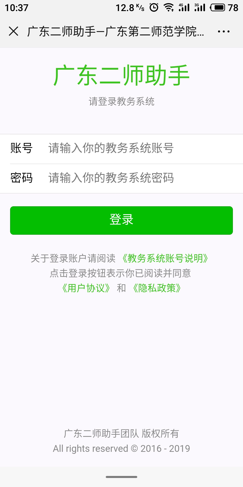
  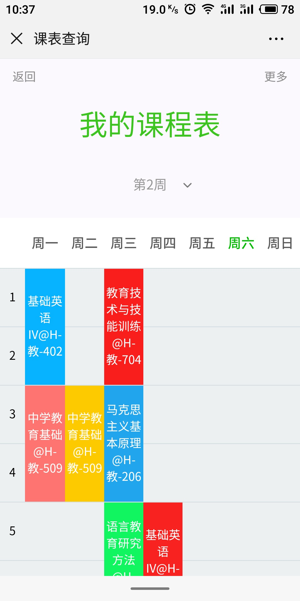
  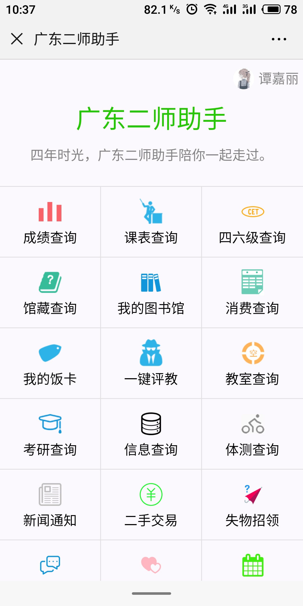
</p>

<p>
  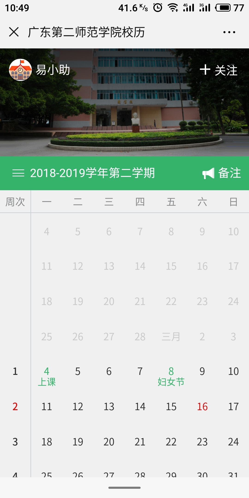
  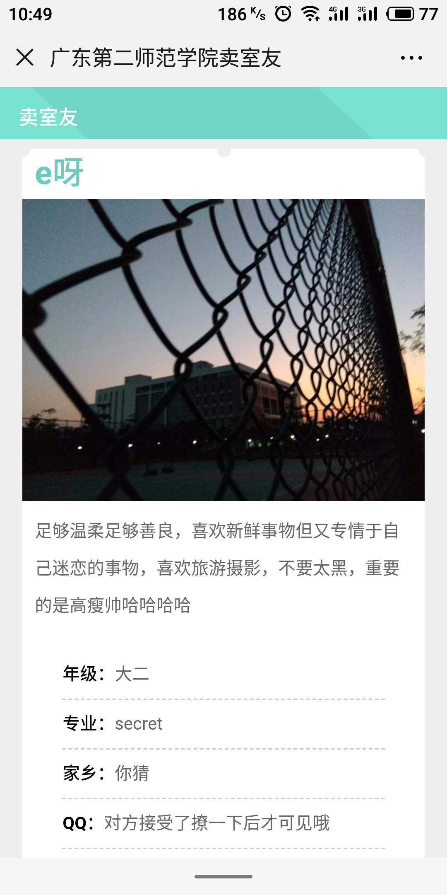
  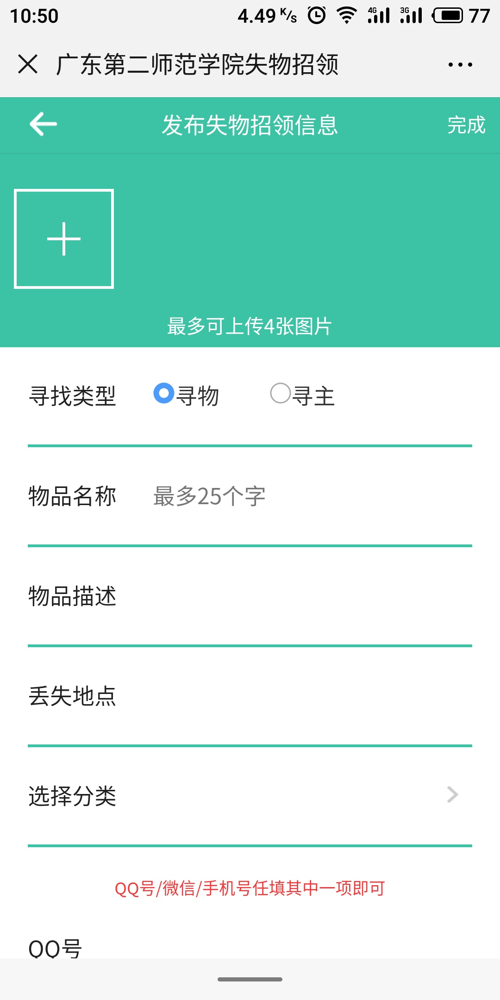
</p>

<p>
  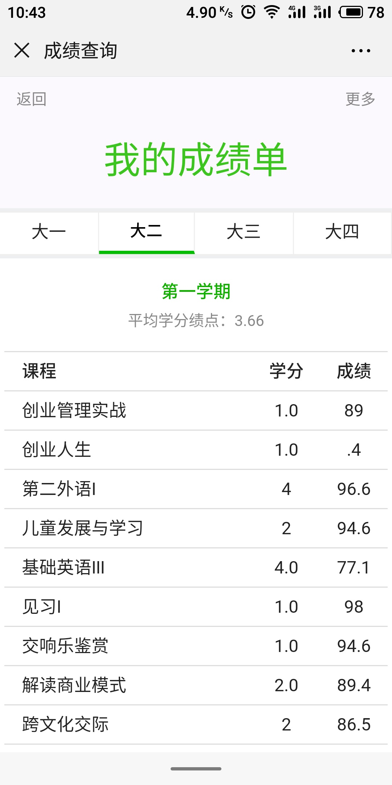
  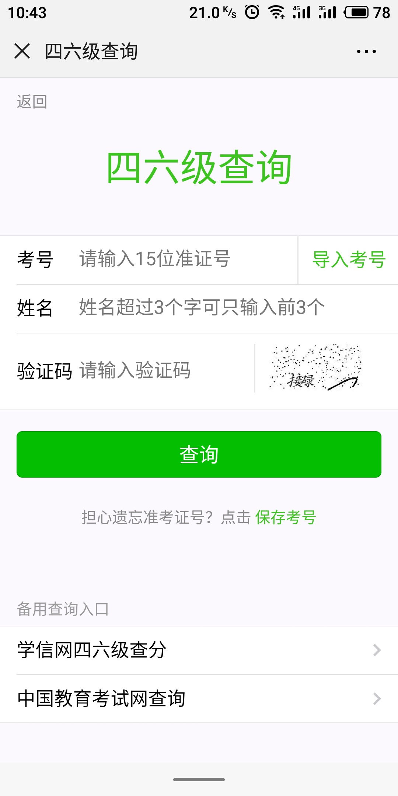
  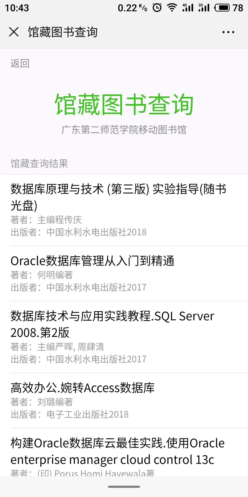
</p>

<p>
  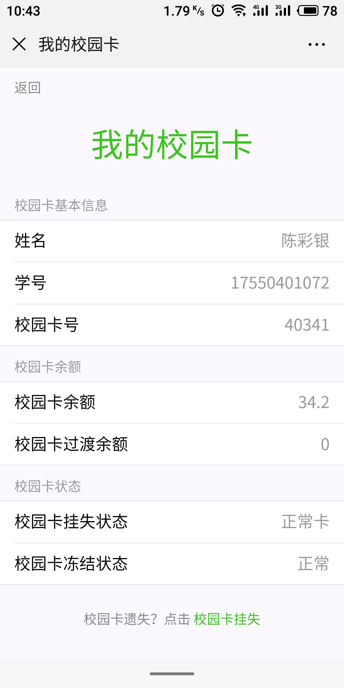
  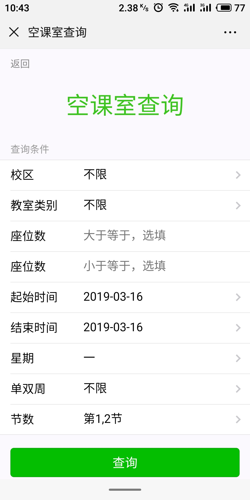
  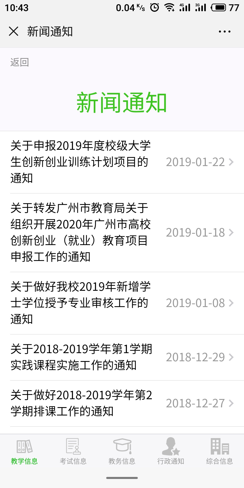
</p>

<p>
  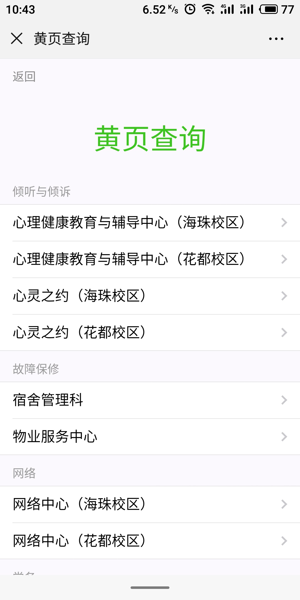
  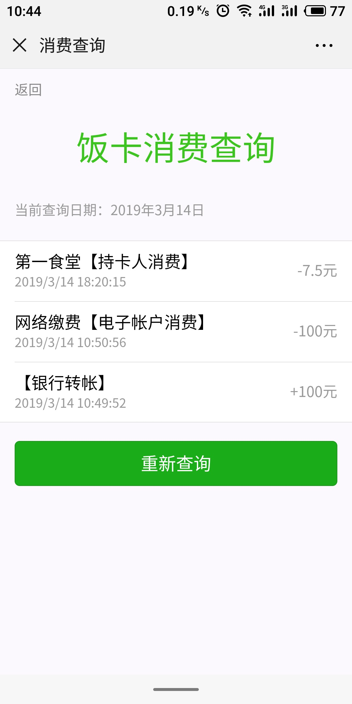
  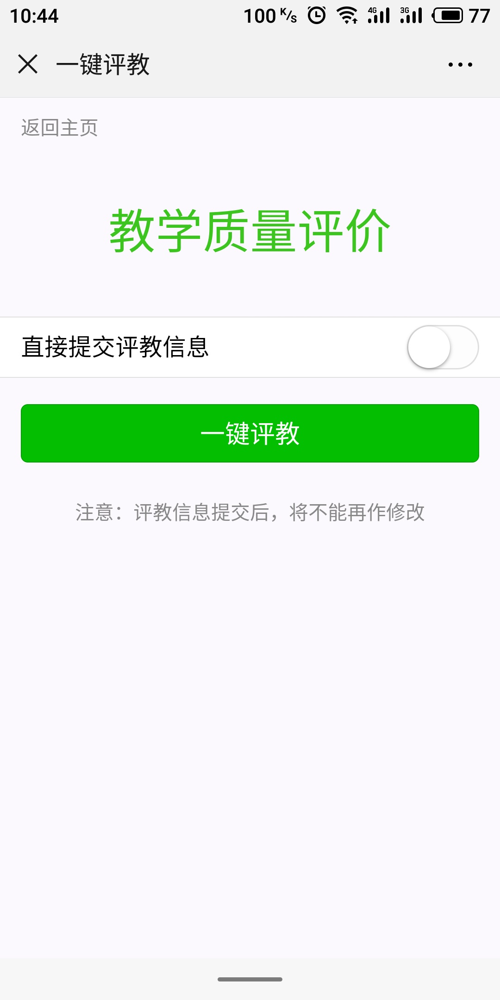
</p>

<p>
  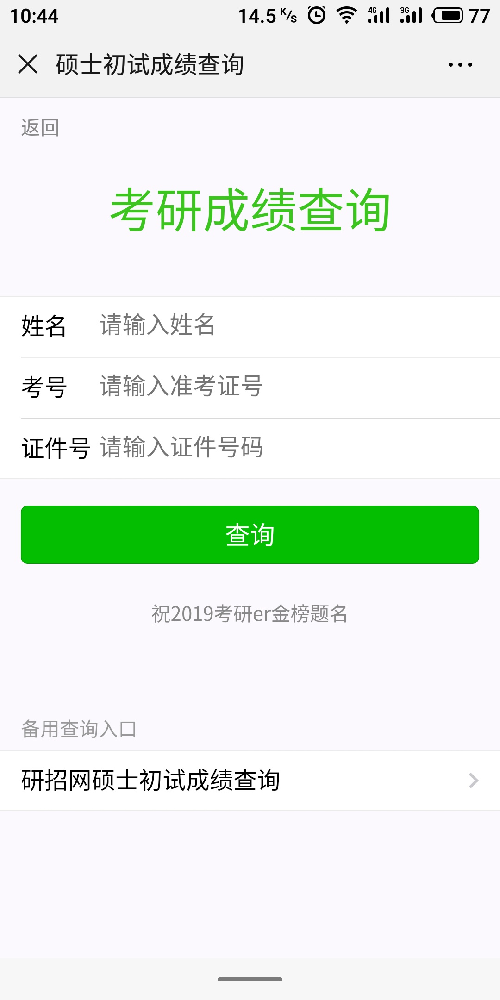
  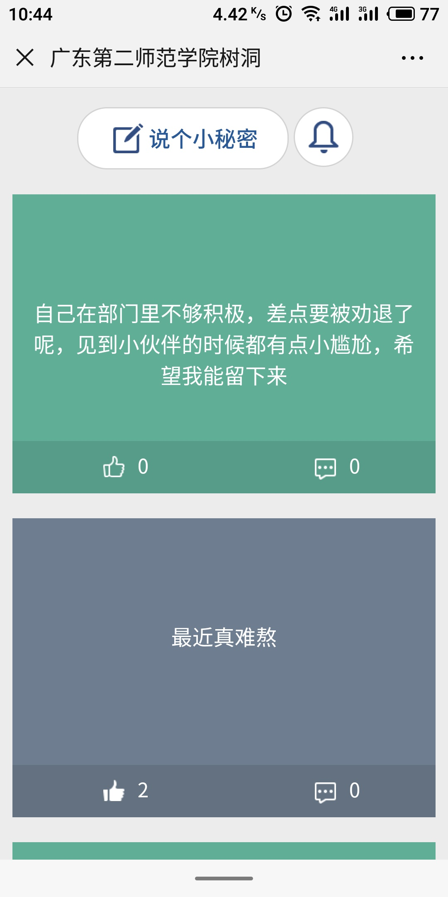
  
</p>

<p>
  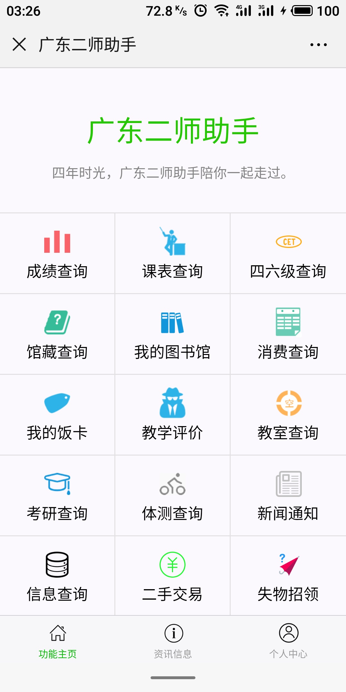
  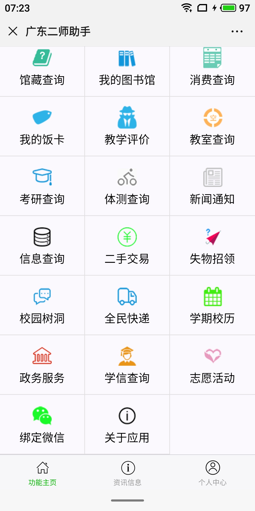
  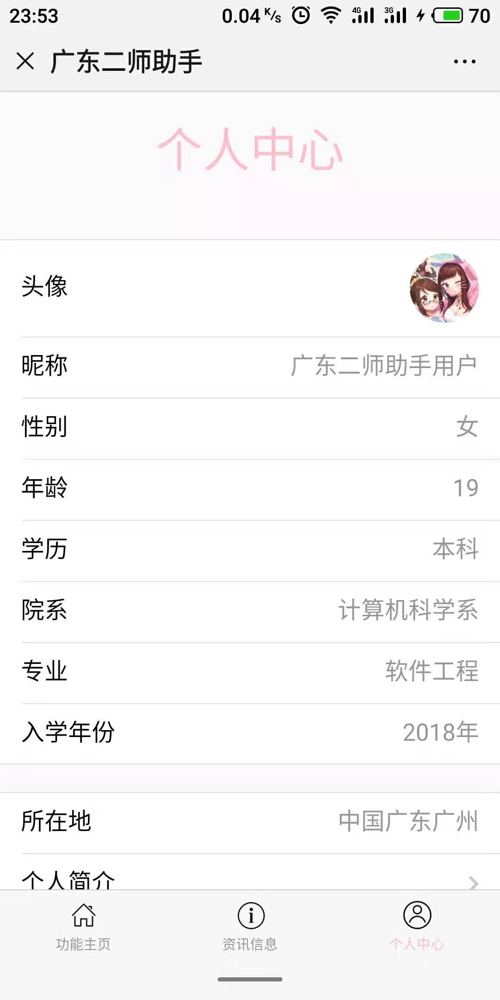
</p>

## 体验

- [广东二师助手官网](https://gdeiassistant.cn)

## 客户端

- [安卓客户端](https://github.com/SweetRadish/GdeiAssistant-Android)
- [微信小程序](https://github.com/SweetRadish/GdeiAssistant-WechatApp)
- [支付宝小程序](https://github.com/SweetRadish/GdeiAssistant-AlipayApp)
- [通用Windows客户端](https://github.com/SweetRadish/GdeiAssistant-UWP)

## 公众号

<p>
  
</p>

## 环境

### 操作系统

- macOS Mojave 10.14.3

### 开发工具

- Intellij Idea 2018.3.5 Ultimate
- Visual Studio Code 1.32
- Navicat for MySQL version 12.1

### 软件环境

- Git 2.21.0
- Gradle 5.1.1
- Tomcat 9.0.16
- JDK 11.0.2
- Mysql 8.0.15
- MongoDB 4.0.4 
- Redis 5.0.3

### 框架组件

- WeUI 1.1.1
- BootStrap 4.0.0
- Spring 4.3.14
- Mybatis 3.4.4
- Jquery 3.2.1
- Log4j 2.10.0
- Jsoup 1.10.3
- HttpClient 4.5.3
- OkHttp 3.8.1

## 初始化

### 克隆仓库

```bash
$ git clone https://github.com/SweetRadish/GdeiAssistant.git
```

### 导入数据库

```bash
$ mysql -u用户名 -p密码 < gdeiassistant.sql
```

### 配置文件

项目中使用了大量的第三方数据接口（如极速数据、百度云、阿里云等），这些数据接口一般都要求调用者提供对应的接口身份凭证（AppID/AppSecret/AppKey等）。在项目中，接口身份凭证或其他重要的配置参数都保存在resources/config目录下对应的*.properties文件中。为保证项目在生产环境的安全性，本项目已对部分关键的配置文件参数进行脱敏处理，这意味你需要自行前往对应的数据接口网站，申请或购买接口使用权限并获得接口身份凭证，并将配置参数填充到对应的配置文件中。若你不填写，则可能导致项目部分模块或整体不可用。

#### 部分特殊的配置文件说明：

1. **安全加密**：阿里聚安全提供了安全加密、安全签名等组件，可以提供安全、可靠、稳定的加密功能，项目在生产环境中使用阿里聚安全提供的安全组件实现加解密功能。jaq目录下的配置文件保存了用于阿里聚安全签名校验和加解密的参数信息。由于阿里聚安全产品业务策略调整，产品于2018年8月1号已正式停止服务和运营。建议开发者自行修改StringEncryptUtils工具类以实现加解密过程。

2. **JWT**：jwt目录下的配置文件保存了生成和校验JSON Web Token使用的HMAC-SHA256算法的密钥，开发者可以自行生成并妥善保存。

3. **Log4j2**：与log4j不同，log4j2使用了XML配置文件，除了输出日志和错误日志外，log4j2还会保存用户的表单请求记录和教务查询记录。开发者可以自行修改log4j2的日志保存路径和策略。

4. **新闻通知**：由于部分学校新闻页面需要用户登录后才拥有权限访问，因此需要在news目录下的account.properties文件中配置你的教务系统账号用户名和密码。

5. **对象存储**：OSS对象存储是阿里云平台提供的海量、安全、低成本、高可靠的云存储服务。oss目录保存了服务端访问OSS服务和生成移动端临时令牌的配置参数。all_policy.txt、bucket_read_policy.txt和bucket_read_write_policy.txt是类JSON结构的RAM权限策略控制配置文件，分别表示允许所有动作、只读和读写。开发者可以使用阿里云平台提供的 [RAM Policy Editor](http://gosspublic.alicdn.com/ram-policy-editor/index.html) 生成授权策略。oss.properties保存的是服务端直接访问OSS服务的AccessKey和SecretKey身份凭证等信息，token.properties保存的是生成移动端临时令牌的RAM角色身份凭证、令牌过期时间和RAM权限策略控制配置文件路径等信息。

6. **防重放攻击**：项目对重要的接口采取了防重放攻击保护，用户请求时，系统将会与随机值、时间戳和令牌值进行字符串拼接或直接与签名或缓存作校验，validate目录下的token.properties保存了令牌值，该值应该与移动端发起网络请求时提交的令牌值相同，才可以校验成功。

## 协议

[MIT License](http://opensource.org/licenses/MIT)

[Anti 996 License](https://github.com/996icu/996.ICU/blob/master/LICENSE)

Copyright (c) 2016 - 2019 GdeiAssistant

## 文档

- 广东第二师范学院校园助手系统说明文档请参考 [Wiki](https://github.com/SweetRadish/GdeiAssistant/wiki)

## 贡献

- 若你喜欢本项目，欢迎Star本项目

- 要贡献代码，欢迎Fork之后再提交[Pull Request](https://github.com/SweetRadish/GdeiAssistant-Android/pulls)

- 如果你有好的意见或建议，欢迎给我们提交[Issue](https://github.com/SweetRadish/GdeiAssistant-Android/issues)

## 联系

- 邮箱：[gdeiassistant@gmail.com](mailto:gdeiassistant@gmail.com)

## 声明

本项目只用作个人学习研究，如因使用本项目导致任何损失，本人概不负责。