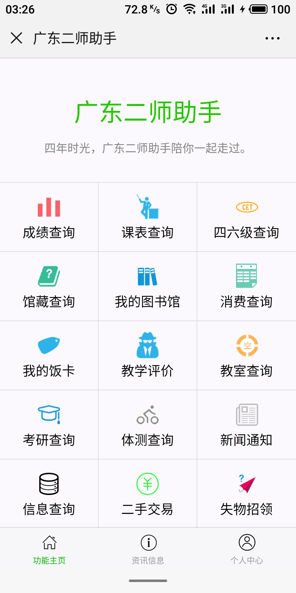
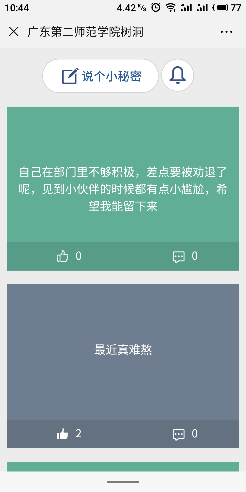

# GdeiAssistant | 广东第二师范学院校园助手系统


广东第二师范学院校园助手系统采用了网络爬虫模拟登录技术和 SpringBoot3 以及 Vue3 框架开发构建，实现了前后端分离和无状态架构。

项目适配了 Docker 容器化与 GraalVM Native Image 技术，支持以原生二进制文件运行，具有毫秒级启动与极低内存占用的优势。

---

## 📂 目录结构概览

```text
GdeiAssistant/                 # 仓库根目录
├── src/main/java/             # 后端 Java 源码
├── frontend/                  # 前端 Vue.js 源码
│   ├── src/
│   ├── package.json
│   └── vite.config.js
├── db-init/                   # 数据库初始化脚本
│   ├── mysql/                 # MySQL 结构与 Mock 数据
│   └── mongodb/               # MongoDB 初始化
├── docker-compose.yml         # 基础设施全栈编排
└── .env.template              # 环境变量配置模板

---

## 快速入门

**1. 环境**  
安装 Docker + Docker Compose。

**2. 配置**  
复制并编辑环境变量：

```bash
cp .env.template .env
```

填写数据库密码、Redis、JWT 等（见模板注释）。

**3. 运行**

- **全栈（Docker）**：`docker compose up -d`（后端 8080，前端 5173）。
- **仅后端**：`./gradlew bootRun`（自动加载根目录 `.env`）。
- **仅前端**：进入前端目录安装依赖并启动开发服务器：

```bash
cd frontend
npm install
npm run dev
```

前端开发服务器默认运行在 `http://localhost:5173`，需配置接口代理指向后端（如 `http://localhost:8080`），参见 `frontend/vite.config.*` 或 `frontend/.env*`。

---

## 技术栈

| 端 | 技术 |
|----|------|
| 后端 | JDK 17、Spring Boot 3.2、MySQL 8.0、MyBatis-Plus、MongoDB、Redis、Gradle 8.x、GraalVM Native Image（可选） |
| 前端 | Vue 3、Vue Router、Vite、Axios、WeUI |

---

## 预览

<p>
  
  
  
</p>

---

## 项目结构

| 路径 | 说明 |
|------|------|
| `src/main/java` | 后端 |
| `frontend/` | Vue 前端 |
| `db-init/mysql/` | MySQL 初始化（含 Mock 数据） |
| `db-init/mongodb/` | MongoDB 初始化（含 Mock 数据） |
| `docker-compose.yml` | 全栈编排 |

---

## 测试账号

`gdeiassistant` / `gdeiassistant`（见 `db-init/mysql/init.sql`）。

---

## 客户端与官网

[官网](https://gdeiassistant.cn) · [功能演示](https://gdeiassistant.azurewebsites.net) · [Android](https://github.com/GdeiAssistant/GdeiAssistant-Android) · [iOS](https://github.com/GdeiAssistant/GdeiAssistant-iOS) · [微信小程序](https://github.com/GdeiAssistant/GdeiAssistant-WechatApp)

---

## 许可证

[Apache License 2.0](LICENSE) · Copyright (c) 2016-2026 GdeiAssistant

